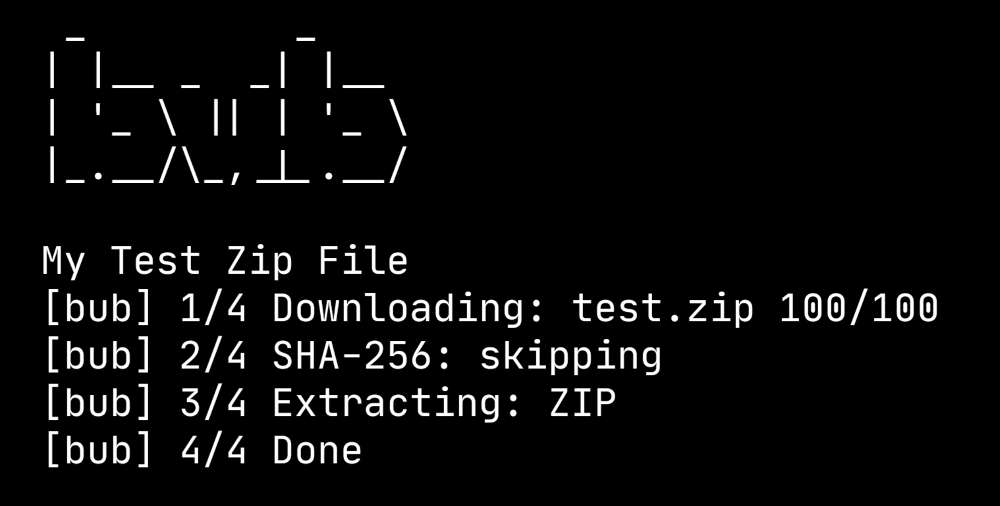

<p align="center">
  
</p>

# bub
bub is a simple downloader that reads .bub files and downloads them.

## Features
- Written entirely in Python
- Easy to make your own .bub filew

## Installation
You can install bub using one of the following methods.

### Linux
Requirments: sudo and wget
```
curl -fsSL https://raw.githubusercontent.com/Ietsiee/bub/main/install.sh | sh
```

### Make
Requirments: sudo, install and make
```
git clone https://github.com/Ietsiee/bub.git
cd bub
sudo make install
```
